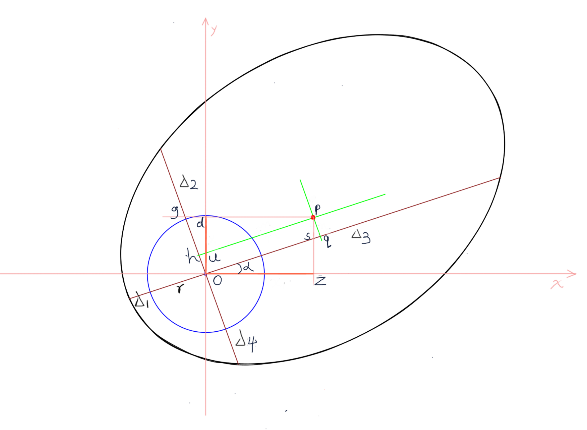

# 中间点计算公式推导

----------------

已知：o 为原点，Δ1、Δ2、Δ3、Δ4

求：pz、pd

由图中可得：
$$
\begin{align}
&\because α + \ang{osz} = 90度;\ \ang{spq} + \ang{psq} = 90度;\ \ang{psq} = \ang{osz} \\
&\therefore α = \ang{spq} \\
&同理：α = \ang{dpu}
\end{align}
$$

$$
\begin{align}
ph &= \frac{Δ_3 - Δ_1}{2} \\
pq &= \frac{Δ_2 - Δ_4}{2} \\
oq &= os + sq \\
oz &= \cos{α} \times os \\
sq &= \tan{α} \times pq \\
\\
ho &= go - gh \\
do &= \cos{α} \times go \\
gh &= \tan{α} \times ph \\
\end{align}
$$
可得：
$$
\begin{cases}
oq = os + sq \\
oz = \cos{α} \times os \\
sq = \tan{α} \times pq
\end{cases} \\
\begin{cases}
oz = \cos{α} \times (oq - sq) \\
sq = \tan{α} \times pq
\end{cases} \\
oz = \cos{α} \times (oq - (\tan{α} \times pq)) \\
oz = \cos{α} \times (hp - (\tan{α} \times pq))
$$
同理：
$$
\begin{cases}
ho = go - gh \\
do = \cos{α} \times go \\
gh = \tan{α} \times ph \\
\end{cases} \\
\begin{cases}
do = \cos{α} \times (ho + gh) \\
gh = \tan{α} \times ph \\
\end{cases} \\
do = \cos{α} \times (ho + (\tan{α} \times ph)) \\
do = \cos{α} \times (pq + (\tan{α} \times ph))
$$

$$
\begin{cases}
pz = do\\
pd = oz\\
\end{cases}
$$

