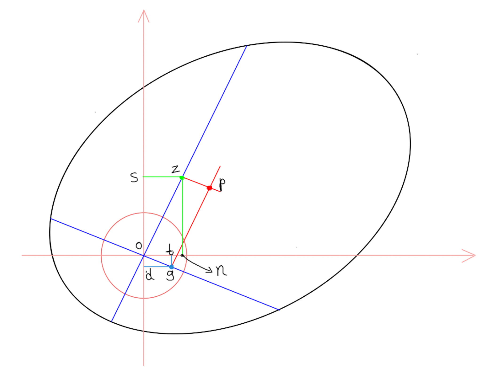

# 中间线计算公式推导

--------------------

已知：zo、og、o、∠zon

求：点 z、g

由图上可得：
$$
\begin{align}
zn &= \sin{\ang{zon}} \times zo \\
on &= \cos{\ang{zon}} \times zo \\
&则点\ z\ 可知 \\[10px]
&\because \ang{zon} + \ang{tog} = 90;\ \ang{dog} + \ang{tog} = 90 \\
&\therefore \ang{zon} = \ang{dog} \\[10px]
dg &= \sin{\ang{zon} \times og} \\
od &= \cos{\ang{zon} \times og} \\
&则点\ g\ 可知
\end{align}
$$
