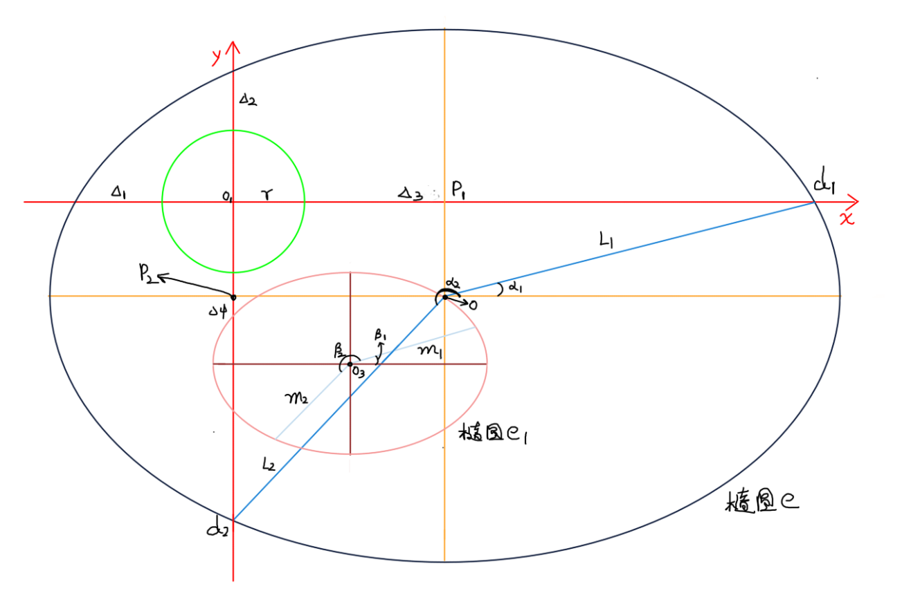

#  圆度仪测量时臂长值求解公式推导

--------------------

如图，有椭圆 e、e1 和圆 c，且 o、o3、角度α1、α2、Δ1、Δ2、Δ3、Δ4 已知，且椭圆 e 长轴 a // x轴；

其中 o 为椭圆 e 圆心，o1 为圆 c 圆心，o3 为椭圆 e1 圆心。设椭圆 e1 长短轴分别为 a1、b1，且均为已知

角度 α1 = β1, α2 = β2

求：测量臂的臂长 r

从图中可知：
$$
\begin{align}
op_1 &= \frac{2r + Δ_2 + Δ_4}{2} - (r + Δ_2) \\
op_1 &= \frac{Δ_4 - Δ_2}{2} \\
\text{同理：} op_2 &= \frac{Δ_3 - Δ_1}{2} \\[10px]
d_1p_1 &= \frac{2r + Δ_1 + Δ_3}{2} \\
d_1p_1 &= r + \frac{Δ_1 + Δ_3}{2} \\
\text{同理：} d_2p_2 &= r + \frac{Δ_2 + Δ_4}{2}
\end{align}
$$
a1、b1 均为已知，可求出 线段 m1 和 m2 的长度可知：
$$
\begin{align}
k_1 &= tan\ β_1 \\
k_2 &= tan\ β_2 \\
m_1 &= f_1(k_1,\ a_1,\ a_2) \\
m_2 &= f_1(k_2,\ a_1,\ a_2) \\
\end{align}
$$

> 此时，m1 和 m2 都为已知值，关于方程 f1 的推导请见 [起于椭圆圆心终止于椭圆边界上一点的线段长度公式推导](./起于椭圆圆心终止于椭圆边界上一点的线段长度公式推导)

在直角三角形 d1 o p1 和 直角三角形 d2 o p2 中，可得公式：
$$
\begin{align}
L_1^2 &= (p_1d_1)^2 + (op_1)^2 \\
L_1^2 &= (r + \frac{Δ_1 + Δ_3}{2})^2 + (\frac{Δ_4 - Δ_2}{2})^2 \\
\text{同理：} \\
L_2^2 &= (p_2d_2)^2 + (op_2)^2 \\
L_2^2 &= (r + \frac{Δ_2 + Δ_4}{2})^2 + (\frac{Δ_3 - Δ_1}{2})^2 \\
\end{align}
$$
则：
$$
\begin{split}
\begin{cases}
\begin{eqnarray*}
L_1 = \sqrt{(r + \frac{Δ_1 + Δ_3}{2})^2 + (\frac{Δ_4 - Δ_2}{2})^2} \tag{1} \\
L_2 = \sqrt{(r + \frac{Δ_2 + Δ_4}{2})^2 + (\frac{Δ_3 - Δ_1}{2})^2} \tag{2}
\end{eqnarray*}
\end{cases}
\end{split}
$$

设 n 为椭圆 e1 和椭圆 e 长轴的比值，则有：
$$
\begin{align}
&& a &= a_1n \\
&& b &= b_1n \\
&& L1 &= m_1n \\
&& L2 &= m_2n \\
\end{align}
$$
联立方程 (1) (2)，可得出 未知数 n、r：
$$
\begin{cases}
m_1n = \sqrt{(r + \frac{Δ_1 + Δ_3}{2})^2 + (\frac{Δ_4 - Δ_2}{2})^2} \\
m_2n = \sqrt{(r + \frac{Δ_2 + Δ_4}{2})^2 + (\frac{Δ_3 - Δ_1}{2})^2}
\end{cases} \\
\begin{cases}
n = \frac{\sqrt{(r + \frac{Δ_1 + Δ_3}{2})^2 + (\frac{Δ_4 - Δ_2}{2})^2}}{m_1}\\
n = \frac{\sqrt{(r + \frac{Δ_2 + Δ_4}{2})^2 + (\frac{Δ_3 - Δ_1}{2})^2}}{m_2}
\end{cases} \\
\begin{align}
\frac{\sqrt{(r + \frac{Δ_1 + Δ_3}{2})^2 + (\frac{Δ_4 - Δ_2}{2})^2}}{m_1} &= \frac{\sqrt{(r + \frac{Δ_2 + Δ_4}{2})^2 + (\frac{Δ_3 - Δ_1}{2})^2}}{m_2} \\
\frac{(r + \frac{Δ_1 + Δ_3}{2})^2 + (\frac{Δ_4 - Δ_2}{2})^2}{m_1^2} &= \frac{(r + \frac{Δ_2 + Δ_4}{2})^2 + (\frac{Δ_3 - Δ_1}{2})^2}{m_2^2} \\
\end{align}
$$

$$
\begin{align}
\frac{(r + \frac{Δ_1 + Δ_3}{2})^2 + (\frac{Δ_4 - Δ_2}{2})^2}{m_1^2} &= \frac{r^2 + r(Δ_1 + Δ_3) + \frac{(Δ_1 + Δ_3)^2}{4} + \frac{(Δ_4 - Δ_2)^2}{4}}{m_1^2} \\

\frac{(r + \frac{Δ_2 + Δ_4}{2})^2 + (\frac{Δ_3 - Δ_1}{2})^2}{m_2^2} &= \frac{r^2 + r(Δ_2 + rΔ_4) + \frac{(Δ_2 + Δ_4)^2}{4} + \frac{(Δ_3 - Δ_1)^2}{4}}{m_2^2} \\
\end{align}
$$

$$
\begin{align}
\frac{r^2 + r(Δ_1 + Δ_3) + \frac{(Δ_1 + Δ_3)^2}{4} + \frac{(Δ_4 - Δ_2)^2}{4}}{m_1^2} &= \frac{r^2 + r(Δ_2 + Δ_4) + \frac{(Δ_2 + Δ_4)^2}{4} + \frac{(Δ_3 - Δ_1)^2}{4}}{m_2^2} \\

m_2^2(r^2 + r(Δ_1 + Δ_3) + \frac{(Δ_1 + Δ_3)^2}{4} + \frac{(Δ_4 - Δ_2)^2}{4}) &= m_1^2(r^2 + r(Δ_2 + Δ_4) + \frac{(Δ_2 + Δ_4)^2}{4} + \frac{(Δ_3 - Δ_1)^2}{4}) \\

m_2^2r^2 + m_2^2r(Δ_1 + Δ_3) + m_2^2(\frac{(Δ_1 + Δ_3)^2}{4} + \frac{(Δ_4 - Δ_2)^2}{4}) &= m_1^2r^2 + m_1^2r(Δ_2 + Δ_4) + m_1^2(\frac{(Δ_2 + Δ_4)^2}{4} + \frac{(Δ_3 - Δ_1)^2}{4}) \\

m_2^2r^2 + m_2^2r(Δ_1 + Δ_3) - m_1^2r^2 - m_1^2r(Δ_2 + Δ_4) &= m_1^2(\frac{(Δ_2 + Δ_4)^2}{4} + \frac{(Δ_3 - Δ_1)^2}{4}) - m_2^2(\frac{(Δ_1 + Δ_3)^2}{4} + \frac{(Δ_4 - Δ_2)^2}{4}) \\

r^2(m_2^2 - m_1^2) + r(m_2^2(Δ_1 + Δ_3) - m_1^2(Δ_2 + Δ_4)) &= m_1^2(\frac{(Δ_2 + Δ_4)^2}{4} + \frac{(Δ_3 - Δ_1)^2}{4}) - m_2^2(\frac{(Δ_1 + Δ_3)^2}{4} + \frac{(Δ_4 - Δ_2)^2}{4}) \\

r^2(m_2^2 - m_1^2) + r(m_2^2(Δ_1 + Δ_3) - m_1^2(Δ_2 + Δ_4)) &= \frac{m_1^2((Δ_2 + Δ_4)^2 + (Δ_3 - Δ_1)^2) - m_2^2((Δ_1 + Δ_3)^2 - (Δ_4 - Δ_2)^2)}{4} \\
\end{align}
$$
可规整为：
$$
\begin{align}
r^2(m_2^2 - m_1^2) + r(m_2^2(Δ_1 + Δ_3) - m_1^2(Δ_2 + Δ_4)) + \frac{m_2^2((Δ_1 + Δ_3)^2 - (Δ_4 - Δ_2)^2) - m_1^2((Δ_2 + Δ_4)^2 + (Δ_3 - Δ_1)^2)}{4} &= 0 \\
\end{align}
$$
则：
$$
\text{在一元二次方程 } ax^2 + bx + c = 0 \text{ 体现在此方程中为：} \\

\begin{cases}
a = m_2^2 - m_1^2 \\[10px]
b = m_2^2(Δ_1 + Δ_3) - m_1^2(Δ_2 + Δ_4) \\[5px]
c = \frac{m_2^2((Δ_1 + Δ_3)^2 - (Δ_4 - Δ_2)^2) - m_1^2((Δ_2 + Δ_4)^2 + (Δ_3 - Δ_1)^2)}{4}
\end{cases}
$$
又一元二次方程求根公式为：
$$
x = \frac{±\sqrt{b^2 - 4ac} - b}{2a}
$$
代入，可得：
$$
\begin{cases}
a = m_2^2 - m_1^2 \\[10px]
b = m_2^2(Δ_1 + Δ_3) - m_1^2(Δ_2 + Δ_4) \\[5px]
c = \frac{m_2^2((Δ_1 + Δ_3)^2 - (Δ_4 - Δ_2)^2) - m_1^2((Δ_2 + Δ_4)^2 + (Δ_3 - Δ_1)^2)}{4}
\end{cases} \\
\begin{cases}
r = \frac{±\sqrt{b^2 - 4ac} - b}{2a} \\
n = \frac{\sqrt{(r + \frac{Δ_1 + Δ_3}{2})^2 + (\frac{Δ_4 - Δ_2}{2})^2}}{m_1}\\
\end{cases}
$$

