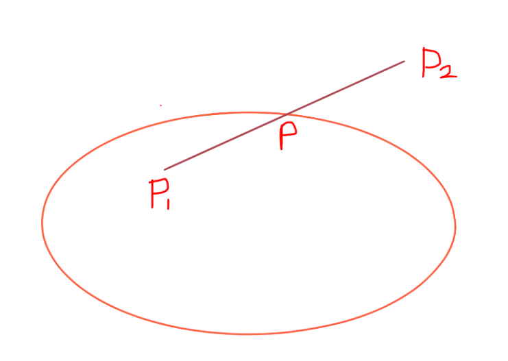

# 线段与椭圆交点公式推导

----------------

在平面直角坐标系中，已知线段 L 与 椭圆 E 相交于 P 点，且 P1 与 P2 分别为 线段 L 的起点和终点。**线段 L 与椭圆 E 只有一个交点 P。**（椭圆E 的圆心位于原点且长轴平行于 x轴）
$$
\begin{align}
设：p_1\ &为\ (x_1, y_1);\\
p_2\ &为\ (x_2, y_2); \\
p\ &为\ (x, y); \\
u\ &为\ 线段\ p_1p\ 与线段\ L\ 的比例因子
\end{align}
$$

根据已知条件可得：
$$
\begin{cases}
x = x_1 + u(x_2 - x_1) \\
y = y_1 + u(y_2 - y_1) \tag 1
\end{cases}
$$

椭圆 E 的方程：
$$
\frac{x^2}{a^2} + \frac{y^2}{b^2} = 1
$$
化简得：
$$
\begin{align}
&& \frac{x^2}{a^2} &= 1 - \frac{y^2}{b^2} \\
&& x^2 &= a^2 - \frac{a^2y^2}{b^2}\\
&& x^2 &= \frac{a^2b^2 - a^2y^2}{b^2} \tag 2
\end{align}
$$
联立方程 (1) 和 (2)：
$$
\begin{align}
&&\begin{cases}
x &= x_1 + u(x_2 - x_1) \\
y &= y_1 + u(y_2 - y_1) \\
x^2 &= \frac{a^2b^2 - a^2y^2}{b^2} \\
\end{cases} \\
&& x^2 &= \frac{a^2b^2 - a^2y^2}{b^2} \\
&& (x_1 + u(x_2 - x_1))^2 &= \frac{a^2b^2 - a^2(y_1 + u(y_2 - y_1))^2}{b^2} \\
&& x_1^2 + 2x_1u(x_2 - x_1) + u^2(x_2 - x_1)^2 &= \frac{a^2b^2 - a^2(y_1^2 + 2y_1u(y_2 - y_1) + u^2(y_2 - y_1)^2)}{b^2} \\[5px]
&& x_1^2b^2 + 2x_1ub^2(x_2 - x_1) + u^2b^2(x_2 - x_1)^2 &= a^2b^2 - y_1^2a^2 - 2y_1ua^2(y_2 - y_1) - u^2a^2(y_2 - y_1)^2 \\[5px]
&& 2x_1ub^2(x_2 - x_1) + u^2b^2(x_2 - x_1)^2 + 2y_1ua^2(y_2 - y_1) + u^2a^2(y_2 - y_1)^2 &= a^2b^2 - y_1^2a^2 - x_1^2b^2\\[5px]
&& u^2(b^2(x_2 - x_1)^2 + a^2(y_2 - y_1)^2) + 2u(x_1b^2(x_2 - x_1) + y_1a^2(y_2 - y_1)) &= a^2b^2 - y_1^2a^2 - x_1^2b^2\\
\end{align}
$$
凑整公式：
$$
\begin{align}
&& &u^2(b^2(x_2 - x_1)^2 + a^2(y_2 - y_1)^2) + 2u(x_1b^2(x_2 - x_1) + y_1a^2(y_2 - y_1)) \\[5px]
&& \text{根据：} &(a + b)^2 = a^2 + 2ab + b^2 \\
&& \text{可凑整为：} &(u\sqrt{b^2(x_2 - x_1)^2 + a^2(y_2 - y_1)^2} + c)^2 - c^2 \\
&& \text{则：} 2uc\sqrt{b^2(x_2 - x_1)^2 + a^2(y_2 - y_1)^2} &= 2u(x_1b^2(x_2 - x_1) + y_1a^2(y_2 - y_1)) \\[5px]
&& c &= \frac{x_1b^2(x_2 - x_1) + y_1a^2(y_2 - y_1)}{\sqrt{b^2(x_2 - x_1)^2 + a^2(y_2 - y_1)^2}} \\[15px]
\end{align}
$$

$$
\text{所以：}u^2(b^2(x_2 - x_1)^2 + a^2(y_2 - y_1)^2) + 2u(x_1b^2(x_2 - x_1) + y_1a^2(y_2 - y_1)) = \\(u\sqrt{b^2(x_2 - x_1)^2 + a^2(y_2 - y_1)^2} + \frac{x_1b^2(x_2 - x_1) + y_1a^2(y_2 - y_1)}{\sqrt{b^2(x_2 - x_1)^2 + a^2(y_2 - y_1)^2}})^2 - (\frac{x_1b^2(x_2 - x_1) + y_1a^2(y_2 - y_1)}{\sqrt{b^2(x_2 - x_1)^2 + a^2(y_2 - y_1)^2}})^2 \\[5px]
$$

继续求解：
$$
\begin{align}
&& u^2(b^2(x_2 - x_1)^2 + a^2(y_2 - y_1)^2) + 2u(x_1b^2(x_2 - x_1) + y_1a^2(y_2 - y_1)) &= a^2b^2 - y_1^2a^2 - x_1^2b^2\\[5px]
&& (u\sqrt{b^2(x_2 - x_1)^2 + a^2(y_2 - y_1)^2} + \frac{x_1b^2(x_2 - x_1) + y_1a^2(y_2 - y_1)}{\sqrt{b^2(x_2 - x_1)^2 + a^2(y_2 - y_1)^2}})^2 - (\frac{x_1b^2(x_2 - x_1) + y_1a^2(y_2 - y_1)}{\sqrt{b^2(x_2 - x_1)^2 + a^2(y_2 - y_1)^2}})^2 &= a^2b^2 - y_1^2a^2 - x_1^2b^2\\[15px]
\end{align}
$$

$$
\begin{align}
&& \text{设：}E &= b^2(x_2 - x_1)^2 + a^2(y_2 - y_1)^2,\ F = x_1b^2(x_2 - x_1) + y_1a^2(y_2 - y_1)\\[15px]
&& (u\sqrt{E} + \frac{F}{\sqrt{E}})^2 - (\frac{F}{\sqrt{E}})^2 &= a^2b^2 - y_1^2a^2 - x_1^2b^2\\
&& (u\sqrt{E} + \frac{F}{\sqrt{E}})^2 &= a^2b^2 - y_1^2a^2 - x_1^2b^2 + (\frac{F}{\sqrt{E}})^2\\
&& (u\sqrt{E} + \frac{F}{\sqrt{E}})^2 &= a^2b^2 - y_1^2a^2 - x_1^2b^2 + \frac{F^2}{E}\\
&& (u\sqrt{E} + \frac{F}{\sqrt{E}})^2 &=  \frac{a^2b^2E - y_1^2a^2E - x_1^2b^2E + F^2}{E}\\
&& u\sqrt{E} + \frac{F}{\sqrt{E}} &=  \frac{±\sqrt{a^2b^2E - y_1^2a^2E - x_1^2b^2E + F^2}}{\sqrt{E}}\\
&& u \sqrt{E} &=  \frac{±\sqrt{a^2b^2E - y_1^2a^2E - x_1^2b^2E + F^2} - F}{\sqrt{E}}\\
&& u &= \frac{±\sqrt{a^2b^2E - y_1^2a^2E - x_1^2b^2E + F^2} - F}{E}\\
&& u &= \frac{±\sqrt{E(a^2b^2 - y_1^2a^2 - x_1^2b^2) + F^2} - F}{E}\\
&& u &= \frac{±\sqrt{E(a^2b^2 - y_1^2a^2 - x_1^2b^2) + F^2}}{E} - \frac{F}{E}\\
&& u &= ±\sqrt{\frac{E(a^2b^2 - y_1^2a^2 - x_1^2b^2) + F^2}{E^2}} - \frac{F}{E}\\
&& u &= ±\sqrt{\frac{a^2(b^2 - y_1^2) - x_1^2b^2}{E} + (\frac{F}{E})^2} - \frac{F}{E}\\
&& u &= ±\sqrt{(\frac{F}{E} + \frac{a^2(b^2 - y_1^2) - x_1^2b^2}{2F})^2 - (\frac{a^2(b^2 - y_1^2) - x_1^2b^2}{2F})^2} - \frac{F}{E}\\
\end{align}
$$
代入 E、F：
$$
\begin{align}
&& E &= b^2(x_2 - x_1)^2 + a^2(y_2 - y_1)^2,\ F = x_1b^2(x_2 - x_1) + y_1a^2(y_2 - y_1)\\[15px]
&& u &= ±\sqrt{\frac{a^2(b^2 - y_1^2) - x_1^2b^2}{E} + (\frac{F}{E})^2} - \frac{F}{E}\\
&& u &= ±\sqrt{\frac{a^2(b^2 - y_1^2) - x_1^2b^2}{b^2(x_2 - x_1)^2 + a^2(y_2 - y_1)^2} + (\frac{x_1b^2(x_2 - x_1) + y_1a^2(y_2 - y_1)}{b^2(x_2 - x_1)^2 + a^2(y_2 - y_1)^2})^2} - \frac{x_1b^2(x_2 - x_1) + y_1a^2(y_2 - y_1)}{b^2(x_2 - x_1)^2 + a^2(y_2 - y_1)^2}\\
\end{align}
$$

----------

程序步骤分解：
$$
\begin{align}
&&&1.\ float\ e = b^2(x_2 - x_1)^2 + a^2(y_2 - y_1)^2 \\[10px]
&&&2.\ float\ f = x_1b^2(x_2 - x_1) + y_1a^2(y_2 - y_1) \\
&&&3.\ float\ tmpValue = \frac{f}{e},\ tmpValue2 =  \frac{a^2(b^2 - y_1^2) - x_1^2b^2}{e} \\
&&&4.\ u1 = \sqrt{tmpValue2 + tmpValue^2} - tempValue \\
&&&5.\ u2 = -\sqrt{tmpValue2 + tmpValue^2} - tempValue \\[5px]
&&&6.\ \text{判断 u1 和 u2，如果某一个 u 值位于 (0, 1) 区间中，则此交点确实是此线段与椭圆的交点；否则不是。} \\[10px]
\end{align}
$$
故，一共有 5 种情况：

- 如果线段和圆没有交点，而且都在圆外，则u的两个解都是小于0或者大于1的
- 如果线段和圆没有交点，而且都在圆内，u的两个解符号相反，一个小于0，一个大于1
- 如果线段和圆只有一个交点，则u值中有一个是在0和1之间，另一个不是
- 如果线段和圆有两个交点，则u值得两个解都在0和1之间
- 如果线段和圆相切，则u值只有1个解，且在0和1之间

要求 x 和 y，将 u 代入此公式即可：
$$
\begin{cases}
x = x_1 + u(x_2 - x_1) \\
y = y_1 + u(y_2 - y_1)
\end{cases}
$$
