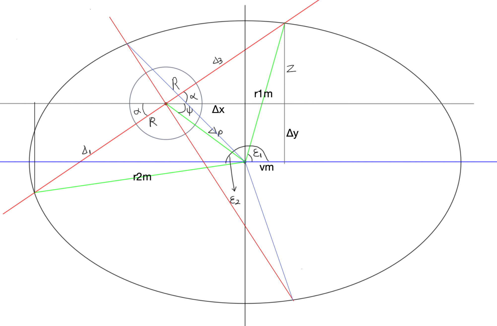

# 臂长求值公式求解

-----------------------------------------------

在由 r2m、r1m、delta1 + delta3 + 2R 三边所组成的三角形A中：

由余角公式 a^2 + b^2 - 2ab cos alpha = c^2 得：
$$
(r_1m)^2 + (r_2m)^2 - 2r_1r_2m^2 \cdot \cos(\epsilon_2 - \epsilon_1) = (2R + \Delta_1 + \Delta_2)^2
$$
在以 vm、z + deltay、r1m 三边组成的三角形B 和 以 deltax + vm、delta3 + R、z 三边组成的三角形C中：

可得到以下关系：
$$
(r_1m)^2 = [(\Delta_3 + R)\cos \alpha - \Delta_x]^2 + [(\Delta_3 + R)\sin\alpha + \Delta_y]^2 \\
(r_2m)^2 = [(\Delta_1 + R)\cos(180 + \alpha) - \Delta_x]^2 + [(\Delta_1 + R)\sin(180 + \alpha) + \Delta_y]^2\\
$$
另由 公式 cos(a1 - a2) = cos a1 * cos a2 + sin a1 * sin a2 可得：
$$
\cos(\epsilon_2 - \epsilon_1) = \cos \epsilon_1 \cdot \cos \epsilon_2 + \sin \epsilon_1 \cdot \sin \epsilon_2\\
$$
设 E = R + delta1、O = R + delta3、ω = (180 + α):
$$
\cos \epsilon_1 = \frac{O\cos \alpha - \Delta_x}{r_1m} \\
\cos \epsilon_2 = \frac{E\cos \omega - \Delta_x}{r_2m} \\
\sin \epsilon_1 = \frac{O\sin \alpha + \Delta_y}{r_1m} \\
\sin \epsilon_2 = \frac{E\sin \omega + \Delta_y}{r_2m} \\
$$
则：
$$
\begin{align}
\cos(\epsilon_2 - \epsilon_1) &= \cos \epsilon_1 \cdot \cos \epsilon_2 + \sin \epsilon_1 \cdot \sin \epsilon_2\\
&= \frac{O\cos \alpha - \Delta_x}{r_1m} \cdot \frac{E\cos \omega - \Delta_x}{r_2m} + \frac{O\sin \alpha + \Delta_y}{r_1m} \cdot \frac{E\sin \omega + \Delta_y}{r_2m}\\
&= \frac{(O\cos \alpha - \Delta_x)(E\cos \omega - \Delta_x)}{r_1r_2m^2} + \frac{(O\sin \alpha + \Delta_y)(E\sin \omega + \Delta_y)}{r_1r_2m^2}\\
&= \frac{(O\cos \alpha - \Delta_x)(E\cos \omega - \Delta_x) + (O\sin \alpha + \Delta_y)(E\sin \omega + \Delta_y)}{r_1r_2m^2}\\
\end{align}
$$
则：
$$
\begin{align}
&2r_1r_2m^2 \cdot cos(\epsilon_2 - \epsilon_1)\\
= &2(O\cos \alpha - \Delta_x)(E\cos \omega - \Delta_x) + 2(O\sin \alpha + \Delta_y)(E\sin \omega + \Delta_y)\\
= &2[(R + \Delta_3)\cos \alpha - \Delta_x][(R + \Delta_1)\cos(180 + \alpha) - \Delta_x]+ 2[(R + \Delta_3)\sin \alpha + \Delta_y][(R + \Delta_1)\sin(180 + \alpha) + \Delta_y]
\end{align}
$$
另：
$$
\begin{align}
&(2R + \Delta_1 + \Delta_3)^2 \\
= &(2R + (\Delta_1 + \Delta_3))^2 \\
= &4R^2 + 4R(\Delta_1 + \Delta_3) + (\Delta_1 + \Delta_3)^2 \\
= &4R^2 + 4R(\Delta_1 + \Delta_3) + \Delta_1^2 + 2\Delta_1\Delta_3 + \Delta_3^2 \\
\end{align}
$$

------------------------------

至此：
$$
\begin{align}
(r_1m)^2 &= [(\Delta_3 + R)\cos \alpha - \Delta_x]^2 + [(\Delta_3 + R)\sin\alpha + \Delta_y]^2 \\
(r_2m)^2 &= [(\Delta_1 + R)\cos(180 + \alpha) - \Delta_x]^2 + [(\Delta_1 + R)\sin(180 + \alpha) + \Delta_y]^2\\
2r_1r_2m^2 \cdot cos(\epsilon_2 - \epsilon_1) &= 2[(R + \Delta_3)\cos \alpha - \Delta_x][(R + \Delta_1)\cos(180 + \alpha) - \Delta_x]+ 2[(R + \Delta_3)\sin \alpha + \Delta_y][(R + \Delta_1)\sin(180 + \alpha) + \Delta_y]\\
(2R + \Delta_1 + \Delta_3)^2 &= 4R^2 + 4R(\Delta_1 + \Delta_3) + \Delta_1^2 + 2\Delta_1\Delta_3 + \Delta_3^2
\end{align}
$$

先推导 (r1m)^2 + (r2m)^2: (已知 sin(180 + a) = - sin a, cos(180 + a) = - cos a)
$$
\begin{align}
&(r_1m)^2 + (r_2m)^2\\
= &[(\Delta_3 + R)\cos \alpha - \Delta_x]^2 + [(\Delta_3 + R)\sin\alpha + \Delta_y]^2 + [(\Delta_1 + R)\cos(180 + \alpha) - \Delta_x]^2 + [(\Delta_1 + R)\sin(180 + \alpha) + \Delta_y]^2 \\

= &[(\Delta_3 + R)\cos \alpha - \Delta_x]^2 + [(\Delta_3 + R)\sin\alpha + \Delta_y]^2 + [-(\Delta_1 + R)\cos \alpha - \Delta_x]^2 + [-(\Delta_1 + R)\sin \alpha + \Delta_y]^2 \\

& 展开平方项： \\
= &(\underline{(\Delta_3 + R)\cos \alpha)^2} - 2\Delta_x(\Delta_3 + R)\cos \alpha + \underset{\sim}{\Delta_x^2} + \\
&(\underline{(\Delta_3 + R)\sin \alpha)^2} + 2\Delta_y(\Delta_3 + R)\sin \alpha + \underset{\sim}{\Delta_y^2} + \\
&(\underline{(\Delta_1 + R)\cos \alpha)^2} + 2\Delta_x(\Delta_1 + R)\cos \alpha + \underset{\sim}{\Delta_x^2} + \\
&(\underline{(\Delta_1 + R)\sin \alpha)^2} - 2\Delta_y(\Delta_1 + R)\sin \alpha + \underset{\sim}{\Delta_y^2} \\

&分别合并带有下划线和波浪线 项\\
= &(\Delta_3 + R)^2 + (\Delta_1 + R)^2 + 2\Delta_x^2 + 2\Delta_y^2 \\
&\underline{- 2\Delta_x(\Delta_3 + R)\cos \alpha} \\
&\underline{+ 2\Delta_y(\Delta_3 + R)\sin \alpha} \\
&\underline{+ 2\Delta_x(\Delta_1 + R)\cos \alpha} \\
&\underline{- 2\Delta_y(\Delta_1 + R)\sin \alpha} \\

& 下划线项可合并为两组公式：\\
= &(\Delta_3 + R)^2 + (\Delta_1 + R)^2 + 2\Delta_x^2 + 2\Delta_y^2 \\
&- 2\Delta_x\cos \alpha ((\Delta_3 + R) - (\Delta_1 + R)) \\
&+ 2\Delta_y\sin \alpha ((\Delta_3 + R) - (\Delta_1 + R)) \\

= &(\Delta_3 + R)^2 + (\Delta_1 + R)^2 + 2\Delta_x^2 + 2\Delta_y^2 \\
&+ (2\Delta_y\sin \alpha - 2\Delta_x\cos \alpha)((\Delta_3 + R) - (\Delta_1 + R)) \\

= &(\Delta_3 + R)^2 + (\Delta_1 + R)^2 + 2\Delta_x^2 + 2\Delta_y^2 + (2\Delta_y\sin \alpha - 2\Delta_x\cos \alpha)(\Delta_3 - \Delta_1) \\

= &(\Delta_3 + R)^2 + (\Delta_1 + R)^2 + 2[\Delta_x^2 + \Delta_y^2 + (\Delta_y\sin \alpha - \Delta_x\cos \alpha)(\Delta_3 - \Delta_1)] \\

= &R^2 + 2R\Delta_3  + \Delta_3^2 + R^2 + 2R\Delta_1 + \Delta_1^2 + 2[\Delta_x^2 + \Delta_y^2 + (\Delta_y\sin \alpha - \Delta_x\cos \alpha)(\Delta_3 - \Delta_1)] \\

= &2R^2 + 2R(\Delta_3 + \Delta_1) + \Delta_3^2 + \Delta_1^2 + 2[\Delta_x^2 + \Delta_y^2 + (\Delta_y\sin \alpha - \Delta_x\cos \alpha)(\Delta_3 - \Delta_1)] \\[30px]

= &2[R^2 + R(\Delta_3 + \Delta_1) + \frac{\Delta_3^2 + \Delta_1^2}{2} + \Delta_x^2 + \Delta_y^2 + (\Delta_y\sin \alpha - \Delta_x\cos \alpha)(\Delta_3 - \Delta_1)] \\
\end{align}
$$

再推导 2 * r1 * r2 * m^2 * cos(ε2 - ε1):
$$
\begin{align}
&2[(R + \Delta_3)\cos \alpha - \Delta_x][(R + \Delta_1)\cos(180 + \alpha) - \Delta_x] \\
&+ 2[(R + \Delta_3)\sin \alpha + \Delta_y][(R + \Delta_1)\sin(180 + \alpha) + \Delta_y] \\

= &2[(R + \Delta_3)\cos \alpha - \Delta_x][-(R + \Delta_1)\cos \alpha - \Delta_x] \\
&+ 2[(R + \Delta_3)\sin \alpha + \Delta_y][-(R + \Delta_1)\sin \alpha + \Delta_y] \\

&拆括号 \\
= &2[\underline{-(R + \Delta_1)(R + \Delta_3)(\cos \alpha)^2} - (R + \Delta_3)\cos \alpha \Delta_x + (R + \Delta_1)\cos \alpha \Delta_x + \Delta_x^2\\
&\underline{-(R + \Delta_1)(R + \Delta_3)(\sin \alpha)^2} + (R + \Delta_3)\sin \alpha \Delta_y - (R + \Delta_1)\sin \alpha \Delta_y + \Delta_y^2] \\

&合并 \\
= &2[-(R + \Delta_1)(R + \Delta_3) \underline{- (R + \Delta_3)(\cos \alpha \Delta_x - \sin \alpha \Delta_y) + (R + \Delta_1)(\cos \alpha \Delta_x - \sin \alpha \Delta_y)} + \Delta_x^2 + \Delta_y^2] \\

= &2[-(R + \Delta_1)(R + \Delta_3) + ((R + \Delta_1) - (R + \Delta_3))(\cos \alpha \Delta_x - \sin \alpha \Delta_y) + \Delta_x^2 + \Delta_y^2] \\

= &2[-(R + \Delta_1)(R + \Delta_3) + (\Delta_1 - \Delta_3)(\cos \alpha \Delta_x - \sin \alpha \Delta_y) + \Delta_x^2 + \Delta_y^2] \\

= &2[-(R + \Delta_1)(R + \Delta_3) + (\Delta_3 - \Delta_1)(\sin \alpha \Delta_y - \cos \alpha \Delta_x) + \Delta_x^2 + \Delta_y^2] \\

= &2[-(R^2 + R\Delta_3 + R\Delta_1 + \Delta_1\Delta_3) + (\Delta_3 - \Delta_1)(\sin \alpha \Delta_y - \cos \alpha \Delta_x) + \Delta_x^2 + \Delta_y^2] \\[30px]

= &2[-R^2 - R(\Delta_3 + \Delta_1) - \Delta_1\Delta_3 + (\Delta_3 - \Delta_1)(\sin \alpha \Delta_y - \cos \alpha \Delta_x) + \Delta_x^2 + \Delta_y^2] \\
\end{align}
$$

由于 2 * r1 * r2 * m^2 * cos(ε2 - ε1) 是负项，所以应当 * -1:
$$
2[R^2 + R(\Delta_3 + \Delta_1) + \Delta_1\Delta_3 - (\Delta_3 - \Delta_1)(\sin \alpha \Delta_y - \cos \alpha \Delta_x) - \Delta_x^2 - \Delta_y^2] \\
$$

---------------------------

$$
\begin{align}
[(r_1m)^2 + (r_2m)^2] + [- 2r_1r_2m^2 \cdot \cos(\epsilon_2 - \epsilon_1)] &= [(2R + \Delta_1 + \Delta_2)^2] \\[10px]

2[R^2 + R(\Delta_3 + \Delta_1) + \frac{\Delta_3^2 + \Delta_1^2}{2} + \Delta_x^2 + \Delta_y^2 + (\Delta_y\sin \alpha - \Delta_x\cos \alpha)(\Delta_3 - \Delta_1)] \\
+ 2[R^2 + R(\Delta_3 + \Delta_1) + \Delta_1\Delta_3 - (\Delta_3 - \Delta_1)(\sin \alpha \Delta_y - \cos \alpha \Delta_x) - \Delta_x^2 - \Delta_y^2] \\
&= 4R^2 + 4R(\Delta_1 + \Delta_3) + \Delta_1^2 + 2\Delta_1\Delta_3 + \Delta_3^2 \\[10px]

R^2 + R(\Delta_3 + \Delta_1) + \frac{\Delta_3^2 + \Delta_1^2}{2} \underline{+ \Delta_x^2 + \Delta_y^2 + (\Delta_y\sin \alpha - \Delta_x\cos \alpha)(\Delta_3 - \Delta_1)} \\
+ R^2 + R(\Delta_3 + \Delta_1) + \Delta_1\Delta_3 \underline{- (\Delta_3 - \Delta_1)(\sin \alpha \Delta_y - \cos \alpha \Delta_x) - \Delta_x^2 - \Delta_y^2} \\
&= 2R^2 + 2R(\Delta_1 + \Delta_3) + \Delta_1\Delta_3 + \frac{\Delta_1^2 + \Delta_3^2}{2} \\[10px]

2R^2 + 2R(\Delta_3 + \Delta_1) + \frac{\Delta_3^2 + \Delta_1^2}{2} + \Delta_1\Delta_3 &= 2R^2 + 2R(\Delta_1 + \Delta_3) + \Delta_1\Delta_3 + \frac{\Delta_1^2 + \Delta_3^2}{2} \\[10px]

0 = 0
\end{align}
$$

方程未解出